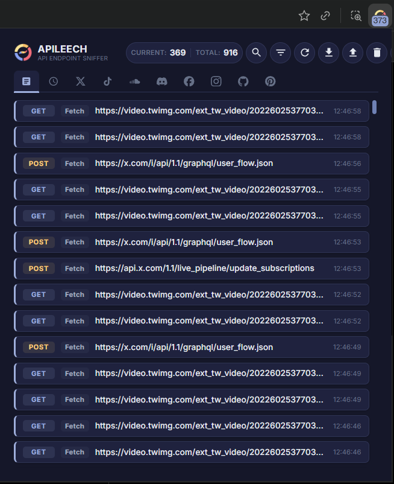
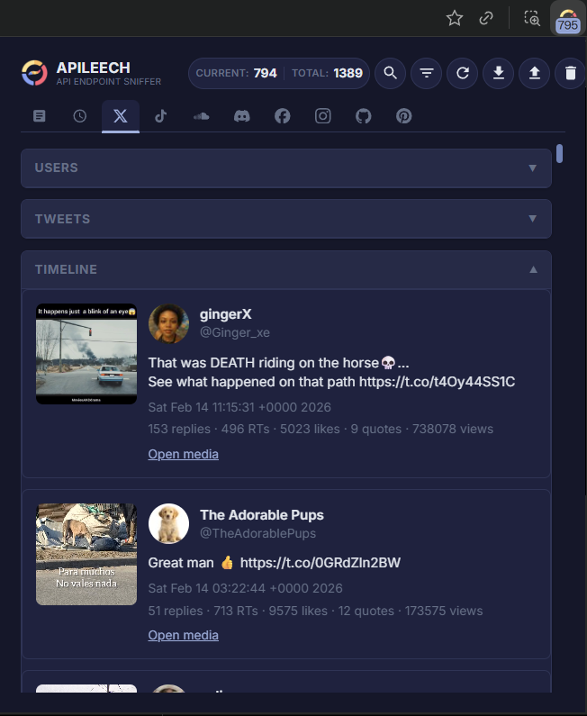
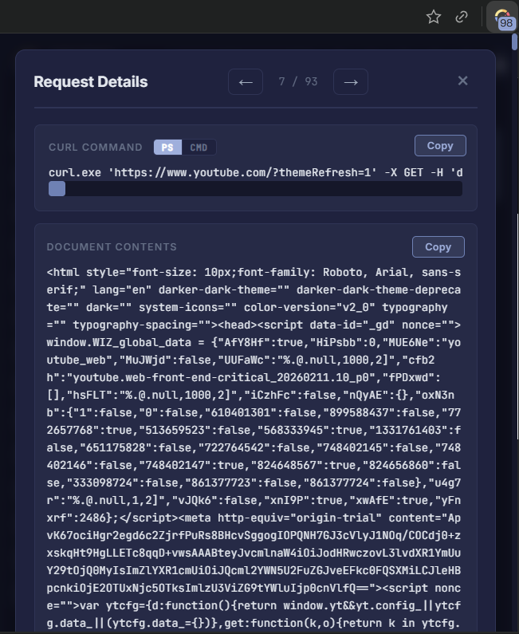
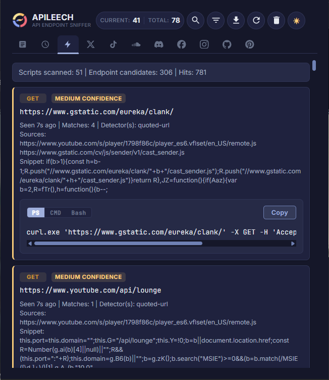

# APILEECH

Chromium (Chrome, Edge, Opera, Brave, etc) extension that captures API requests (including request and response bodies) and gives you copy-paste curl commands. It can **scrape content and messages** from sites (users, posts, comments, etc.) by parsing their API responses. History is kept in memory and can be exported to or imported from a JSON file so it does not fill browser storage.

---

[APILEECH is available on the Chrome Web Store for Chromium-based Browsers](https://chromewebstore.google.com/detail/apileech/nmcppdbckijfleddncfidbcmenhcmjbh?authuser=0&hl=en)

[APILEECH is available on Microsoft Add-on Store for Microsoft Edge](https://microsoftedge.microsoft.com/addons/detail/apileech/cmbobajnibidgjppebnfcpleaifcenjk)

## How it works

The extension uses two layers to capture traffic:

1. **Background (webRequest)**  
   The service worker listens to `webRequest` for navigation and XHR/fetch. It gets URL, method, tab, initiator, and when the platform provides it, request body. It does not see response bodies from here.

2. **Page script (injected)**  
   A content script injects a script into every page. That script patches `window.fetch` and `XMLHttpRequest.prototype.open`/`send`. When the page calls fetch or XHR, the injected code sees the exact arguments (URL, method, body) and the response body (from the promise or `responseText`). It posts these to the content script, which forwards them to the background.

The background matches incoming body/response messages to the right request (by URL + method + timing) and merges them. So you end up with one request object that has: URL, method, headers (from webRequest), request body (from the page), and response body (from the page). For the main document load, the extension also captures the document HTML once the page fires `load` and attaches it as the response for the document request.

The popup asks the background for the current request list, shows it in a list, and when you open a request it builds a curl command from the stored URL, method, headers, and body. You can choose **PowerShell**, **CMD**, or **Bash** (Linux/macOS) and copy the command to run in your terminal.

---

## What it captures

- **URL** – Full request URL  
- **Method** – GET, POST, etc.  
- **Headers** – From webRequest (including cookies if the extension has access)  
- **Request body** – Whatever was passed to `fetch()` or `xhr.send()` (string, JSON, FormData serialized, etc.). This is what the page actually sent.  
- **Response body** – Text returned from the server as seen by the page (e.g. JSON, HTML). For the main frame document, the captured “response” is the document HTML at load time.  
- **Metadata** – Timestamp, type (document vs fetch), tab id, initiator.

Bodies are truncated at configurable character limits (see `background.js`) to avoid blowing memory. Large payloads are cut and a truncation note is appended. I added this because shit kept crashing.

---

## Difference from copying curl from the browser Network tab

In DevTools, “Copy as cURL” uses what the browser’s network stack has. For many requests that’s enough. The main gaps:

- **Request body** – For fetch/XHR, the body you passed in JavaScript might not be represented the same way in the network log, or might be missing. This extension reads the body at the call site (in the page), so you get the exact string or serialized form the script used.  
- **Response body** – You can inspect the response in DevTools, but it’s not part of the copied curl. Here, the response is captured and stored so you can see it in the same place as the request and copy it separately if needed.  
- **Where curl runs** – The extension outputs curl with quoting and escaping for your target shell. Use **PS** (PowerShell) or **CMD** (Command Prompt) on Windows, or **Bash** for Linux and macOS (standard `curl` with single-quoted args). The shell toggle in the request detail view switches between PS, CMD, and Bash.  
- **Persistence** – Network tab state is per tab and goes away on refresh/close. This extension keeps a rolling list in memory (up to a few thousand requests) and you can export/import the list as JSON, so you can save a session and reopen it later without using browser storage for the bulk data.
- **Normie friendly** - Even normies can download media from websites by using our intuitive GUI.

So: same idea as “copy as curl,” but with reliable body capture, response capture, Windows-friendly curl, optional file-based history, and it obviously looks cooler.

---

## Setup

1. Clone or download this repo.  
2. Open Chrome, go to `chrome://extensions`, turn on “Developer mode,” click “Load unpacked.”  
3. Select the folder that contains `manifest.json`.  
4. The extension will ask for permission to read and change data on all sites (needed for webRequest and injection). Approve.

After that, use any site as usual. Open the extension popup to see requests for the active tab (and optionally switch to the History view to see all domains). Click a request to open the detail view and copy the curl command.

---

## What to expect in the UI

**Request list**  
- **Current** tab: requests whose URL or initiator matches the active tab’s hostname.  
- **History** tab: all captured requests, grouped by domain.  
- **Active Interception** tab: endpoint candidates discovered by scanning the page’s JavaScript in real time (see below).  
- Counts: “Current” = count for active tab, “Total” = length of the in-memory list.

**Filtering**  
- **Filter popup** (filter icon in the header): filter the request list by **method** (GET, POST, etc.) and **type** (Fetch vs Document).  
- **Hide static resources**: when enabled (default), requests that look like static assets are hidden from the list. That includes: scripts (`.js`, `.mjs`, `.ts`, etc.), styles (`.css`, `.scss`), images, fonts, common CDN domains (e.g. jsdelivr, unpkg, cdnjs), and framework-style paths (e.g. `chunk`, `vendor`, `bundle`). This setting is saved and applies to both Current and History. Toggle it in the filter popup.

**Request detail**  
- cURL command with PS, CMD, or Bash formatting and a Copy button.  
- Request headers and body.  
- Response body (or document contents for main-frame navigations).

**Active Interception**  
- The extension continuously scans **all JavaScript** loaded by the page (including inline and dynamically added scripts) and looks for likely API/endpoint usage: `fetch()`, `axios.get/post/…`, `xhr.open()`, and quoted URLs that look like API paths.  
- Each candidate is shown with **method**, **URL**, **confidence** (high / medium / low), source scripts, and a **single-line curl** with a shell toggle: **PS**, **CMD**, or **Bash**. Use the tabs to switch the visible command and Copy to paste into your terminal.  
- High confidence = detected from a clear fetch/axios/xhr call; medium/low = from generic URL patterns. The list updates as new scripts load. Data is per-tab and cleared on navigation.

**Export / Import**  
- Export: download the current in-memory list as a JSON file (e.g. `requeststealer_history.json`). You choose the path (or use the default name).  
- Import: pick a previously exported JSON file; it replaces the current in-memory list and the popup refreshes. Use this to restore a session or move history between machines.

**Platform-specific tabs (Twitter, TikTok, etc.)**  
- For some sites (e.g. Twitter/X), the extension parses known API responses and shows a structured view: users, tweets, timeline. That’s in addition to the raw request list; the same captured data is used to build those views.

---

## POC

Main popup with request list (current tab). Counts, search, filter (including hide static resources), refresh, export, import, clear. Tabs for Current, History, Active Interception, and site-specific views.

Twitter/X tab with Timeline expanded: parsed tweets from captured API responses (author, text, media thumb, stats).

Twitter/X tab with Users and Tweets sections: parsed user and tweet data from the same captured traffic.

Request detail modal: generated curl (PS/CMD), Copy, and full document/response body.

Download TikTok videos, audio, and captions.

Actively intercept possible endpoints hidden in Javascript.

---

## Technical notes

- **Manifest v3** – Uses a service worker background and declarative permissions.  
- **No browser storage for history** – Captured requests live only in memory (and in any file you export). Theme and small settings still use Chrome storage. If you store requests in browser storage, you will have a bad time.
- **Content script** – Runs at `document_start` on all frames so the injected script is there before most fetch/XHR calls.  
- **GraphQL** – The popup can detect GraphQL requests and offer a combined-query view; the curl you copy is still per-request. I use this to piece together pieces of GraphQL to try to create the full picture. It works sometimes.

## License

N/A

## Contributors

- [@mojidoji](https://github.com/mojidoji) - Feature implementation

